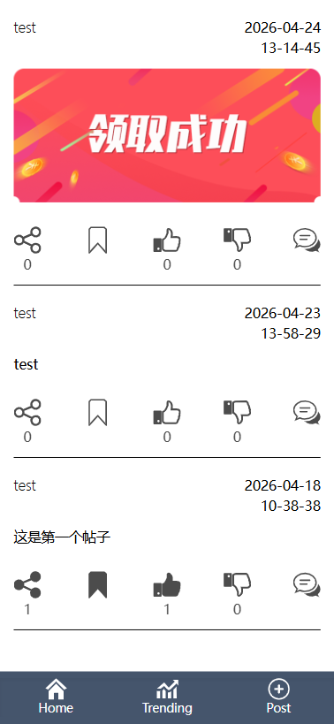

#### package升级
1. 执行`cargo run --bin api GenKey`
axum将`headers` features移至`axum-extra`中


2. `password-hash`中移除`std` features

3. `rand_core`中移除`std` features


#### postgres
```
psql -d postgres -U postgres

CREATE USER test WITH SUPERUSER PASSWORD 123456

createuser -s -p test

psql -d dioxus-x -U postgres root
```

#### Preview
